# Laporan Eksperimen: Perbandingan Tiga Model CNN untuk Deteksi Citra AI-Generated pada Dataset CIFAKE

**Tanggal eksperimen:** 7–8 Oktober 2026
**Repo:** https://github.com/opallep/CIFAKE-DETECTION
**Perangkat:** Laptop, NVIDIA GeForce RTX 4060 Laptop GPU (8 GB)

---

## Daftar isi

1. [Ringkasan hasil](#1-ringkasan-hasil)
2. [Tujuan eksperimen](#2-tujuan-eksperimen)
3. [Lingkungan eksperimen](#3-lingkungan-eksperimen)
4. [Dataset](#4-dataset)
5. [Arsitektur model](#5-arsitektur-model)
6. [Prosedur training dan hyperparameter](#6-prosedur-training-dan-hyperparameter)
7. [Jumlah percobaan](#7-jumlah-percobaan)
8. [Hasil training per model](#8-hasil-training-per-model)
9. [Evaluasi pada data uji](#9-evaluasi-pada-data-uji)
10. [Perbandingan ketiga model](#10-perbandingan-ketiga-model)
11. [Uji kelayakan tambahan](#11-uji-kelayakan-tambahan)
12. [Pembahasan](#12-pembahasan)
13. [Keterbatasan dan ancaman validitas](#13-keterbatasan-dan-ancaman-validitas)
14. [Kesimpulan dan rekomendasi](#14-kesimpulan-dan-rekomendasi)
15. [Cara mereproduksi](#15-cara-mereproduksi)

---

## 1. Ringkasan hasil

Tiga model CNN dilatih dan diuji untuk membedakan citra **asli (REAL)** dan **buatan AI (FAKE)** pada dataset CIFAKE (120.000 citra). Semua model memakai pembagian data, data uji, dan prosedur evaluasi yang sama.

| Peringkat | Model | Akurasi uji | F1-Score | AUC-ROC | Parameter | Inferensi |
|---|---|---|---|---|---|---|
| 🥇 | **EfficientNetV2-B0** | **98,52%** | **98,52%** | **0,9986** | 5,86 juta | 0,52 ms/citra |
| 🥈 | ResNet-50 | 98,16% | 98,15% | 0,9978 | 23,51 juta | 0,93 ms/citra |
| 🥉 | LightweightCNN | 94,75% | 94,74% | 0,9921 | 0,58 juta | 0,10 ms/citra |

**Model terpilih: EfficientNetV2-B0.** Model ini unggul di semua metrik akurasi, paling tahan terhadap kompresi JPEG berat, dan 4× lebih kecil serta 1,8× lebih cepat dibanding ResNet-50. Model ini sudah dipasang di website CekCitra.

---

## 2. Tujuan eksperimen

1. Melatih tiga arsitektur CNN dengan karakteristik berbeda:
   - CNN ringan yang dilatih dari nol
   - dua model transfer learning dari ImageNet
2. Membandingkan kemampuan ketiganya dalam mendeteksi citra buatan AI dari sisi akurasi, keseimbangan antar kelas, efisiensi, dan ketahanan.
3. Memilih model terbaik untuk dipakai pada aplikasi web.

---

## 3. Lingkungan eksperimen

| Komponen | Spesifikasi |
|---|---|
| Sistem operasi | Windows 11 Home |
| GPU | NVIDIA GeForce RTX 4060 Laptop, 8 GB VRAM |
| Python | 3.12.6 |
| PyTorch / torchvision | 2.6.0+cu124 / 0.21.0+cu124 |
| timm | untuk EfficientNetV2-B0 (`tf_efficientnetv2_b0`) |
| Library lain | scikit-learn (metrik), matplotlib dan seaborn (grafik), pandas |
| Seed | 42 (`torch.manual_seed`, `random_split`), `cudnn.deterministic = True` |

---

## 4. Dataset

### 4.1 Sumber

**CIFAKE: Real and AI-Generated Synthetic Images** (Bird & Lotfi, 2024), diunduh dari Kaggle.

- **REAL:** citra asli dari dataset **CIFAR-10**.
- **FAKE:** citra buatan **Stable Diffusion v1.4** yang meniru 10 kategori CIFAR-10 yang sama.

### 4.2 Karakteristik

| Properti | Nilai |
|---|---|
| Format | JPEG, RGB |
| Resolusi | 32 × 32 piksel (semua citra) |
| Kualitas JPEG asli | sekitar **75**, sama untuk REAL dan FAKE (diestimasi dari tabel kuantisasi 400 citra uji) |
| Kelas | 2: `FAKE` (indeks 0), `REAL` (indeks 1) |

Karena kualitas JPEG kedua kelas sama, model **tidak bisa** membedakan kelas hanya dari tingkat kompresinya.

### 4.3 Komposisi

| Split | REAL | FAKE | Total |
|---|---|---|---|
| Train (folder `train/`) | 50.000 | 50.000 | 100.000 |
| Test (folder `test/`) | 10.000 | 10.000 | 20.000 |
| **Total** | **60.000** | **60.000** | **120.000** |

### 4.4 Kategori objek

Kategori **tidak dipakai sebagai label**, tetapi bisa dibaca dari nama file (`xxxx (k).jpg`). Setiap kategori berisi tepat 10% data di setiap folder. Pemetaan kategori diverifikasi secara visual dari 10 sampel per kelompok.

| Kategori | Jenis | Train REAL | Train FAKE | Test REAL | Test FAKE | % |
|---|---|---|---|---|---|---|
| Pesawat (airplane) | Kendaraan | 5.000 | 5.000 | 1.000 | 1.000 | 10% |
| Mobil (automobile) | Kendaraan | 5.000 | 5.000 | 1.000 | 1.000 | 10% |
| Burung (bird) | Hewan | 5.000 | 5.000 | 1.000 | 1.000 | 10% |
| Kucing (cat) | Hewan | 5.000 | 5.000 | 1.000 | 1.000 | 10% |
| Rusa (deer) | Hewan | 5.000 | 5.000 | 1.000 | 1.000 | 10% |
| Anjing (dog) | Hewan | 5.000 | 5.000 | 1.000 | 1.000 | 10% |
| Katak (frog) | Hewan | 5.000 | 5.000 | 1.000 | 1.000 | 10% |
| Kuda (horse) | Hewan | 5.000 | 5.000 | 1.000 | 1.000 | 10% |
| Kapal (ship) | Kendaraan | 5.000 | 5.000 | 1.000 | 1.000 | 10% |
| Truk (truck) | Kendaraan | 5.000 | 5.000 | 1.000 | 1.000 | 10% |

Jadi dataset terdiri dari **hewan 60%** (6 kategori) dan **kendaraan 40%** (4 kategori).

**Pengamatan visual:** citra REAL (CIFAR-10) cenderung berupa foto amatir dengan latar ramai. Citra FAKE cenderung bergaya foto profesional: latar buram (bokeh), objek di tengah, warna lebih dramatis, dan sebagian hitam-putih.

### 4.5 Pembagian data

| Subset | Jumlah | Sumber | Fungsi |
|---|---|---|---|
| Training | 80.000 | 80% folder `train/` | memperbarui bobot model |
| Validasi | 20.000 | 20% folder `train/` | memilih epoch terbaik, scheduler, early stopping |
| Uji | 20.000 | folder `test/` | evaluasi akhir; **tidak pernah dipakai selama training** |

Pembagian train/validasi memakai `random_split` dengan seed 42, sehingga **ketiga model memakai subset yang identik**.

### 4.6 Pra-pemrosesan dan augmentasi

| | LightweightCNN | ResNet-50 dan EfficientNetV2-B0 |
|---|---|---|
| Ukuran input | 32 × 32 (ukuran asli) | 224 × 224 (citra 32×32 diperbesar, bilinear) |
| Normalisasi | mean = std = (0,5; 0,5; 0,5), rentang −1…1 | mean/std ImageNet (0,485; 0,456; 0,406) / (0,229; 0,224; 0,225) |
| Augmentasi training | `RandomHorizontalFlip(0,5)` + `RandomCrop(32, padding=2, reflect)` | `RandomHorizontalFlip(0,3)` |
| Validasi / uji | tanpa augmentasi | tanpa augmentasi |

**Alasan pemilihan augmentasi LightweightCNN:** `RandomRotation` dan `ColorJitter` dari konfigurasi awal sengaja **dihapus**. Rotasi memakai interpolasi bilinear, dan ColorJitter mengubah statistik warna. Keduanya berisiko menghapus artefak frekuensi tinggi dan pola warna yang justru menjadi ciri citra AI.

---

## 5. Arsitektur model

### 5.1 Ringkasan

| | LightweightCNN | ResNet-50 | EfficientNetV2-B0 |
|---|---|---|---|
| Jenis | CNN custom, dilatih dari nol | Transfer learning | Transfer learning |
| Bobot awal | Kaiming (conv), Xavier (linear) | ImageNet (`IMAGENET1K_V2`, torchvision) | ImageNet (`tf_efficientnetv2_b0`, timm) |
| Total parameter | 583.138 | 23.512.130 | 5.861.266 |
| Parameter dilatih | 583.138 (100%) | 14.968.834 (63,7%) | 5.436.310 (92,7%) |
| Parameter dibekukan | 0 | 8.543.296 | 424.956 |
| Ukuran file bobot | 2,36 MB | 94,4 MB | 23,8 MB |

### 5.2 LightweightCNN

8 lapisan konvolusi dalam 4 blok:

| Blok | Lapisan | Output (input 32×32) |
|---|---|---|
| 1 | 2× [Conv 3×3 (32) → BN → ReLU] → MaxPool 2×2 → Dropout2d 0,25 | 32 × 16 × 16 |
| 2 | 2× [Conv 3×3 (64) → BN → ReLU] → MaxPool 2×2 → Dropout2d 0,25 | 64 × 8 × 8 |
| 3 | 2× [Conv 3×3 (128) → BN → ReLU] → MaxPool 2×2 → Dropout2d 0,25 | 128 × 4 × 4 |
| 4 | 2× [Conv 3×3 (128) → BN → ReLU] | 128 × 4 × 4 |
| Head | Global Average Pooling → Dropout 0,5 → Linear(128 → 2) | 2 |

### 5.3 ResNet-50 (transfer learning)

- **Dibekukan:** `conv1`, `bn1`, `layer1`–`layer3`
- **Dilatih ulang:** `layer4`
- **Head baru:** Dropout 0,5 → Linear(2048 → 2)

### 5.4 EfficientNetV2-B0 (transfer learning)

- **Dibekukan:** `conv_stem`, `bn1`, stage 1–4 dari 6 stage
- **Dilatih ulang:** stage 5–6, `conv_head`, `bn2`
- **Head baru:** Linear(1280 → 2)
- Stage 5–6 berisi sebagian besar parameter, sehingga 92,7% parameter ikut dilatih, hampir setara full fine-tuning.

### 5.5 Penanganan BatchNorm pada layer beku

Pada kedua model transfer learning, BatchNorm di layer yang dibekukan **dipertahankan dalam mode `eval`** selama training (fungsi `freeze_bn_stats()` di `models.py`). Tanpa ini, `model.train()` tetap memperbarui `running_mean` dan `running_var` layer beku dengan statistik CIFAKE, sehingga fitur pretrained ImageNet ikut bergeser walaupun bobotnya dibekukan. Perbaikan ini diverifikasi sebelum training: statistik BN beku tetap konstan, sedangkan BN di layer yang dilatih tetap belajar.

---

## 6. Prosedur training dan hyperparameter

### 6.1 Hyperparameter

| Hyperparameter | LightweightCNN | ResNet-50 | EfficientNetV2-B0 |
|---|---|---|---|
| Optimizer | Adam | Adam | Adam |
| Learning rate | 1e-3 (semua layer) | 1e-4 (layer pretrained), 1e-3 (head) | 1e-4 (layer pretrained), 1e-3 (head) |
| Weight decay (L2) | 1e-4 | 1e-4 | 1e-4 |
| Batch size | 128 | 32 | 32 |
| Batch per epoch (train/val) | 625 / 157 | 2.500 / 625 | 2.500 / 625 |
| Loss | CrossEntropyLoss | CrossEntropyLoss | CrossEntropyLoss |
| Maksimal epoch | 25 | 25 | 25 |
| LR scheduler | ReduceLROnPlateau | ReduceLROnPlateau | ReduceLROnPlateau |
| Mixed precision (AMP) | Ya | Ya | Ya |

### 6.2 Mekanisme training

| Mekanisme | Pengaturan |
|---|---|
| **ReduceLROnPlateau** | memantau val accuracy (`mode="max"`), `patience=3`, `factor=0,5`. Learning rate dikali 0,5 setelah **lebih dari 3** epoch tanpa peningkatan |
| **Early stopping** | memantau val accuracy, `patience=7`, `min_delta=0,001`. Berhenti setelah 7 epoch tanpa kenaikan minimal 0,1% dari patokan terbaik |
| **Checkpoint** | bobot disimpan setiap kali val accuracy lebih tinggi dari sebelumnya (`models/<nama>_best.pt`) |
| **Model akhir** | checkpoint dengan val accuracy tertinggi, **bukan** model di epoch terakhir |

Kolom LR pada tabel bagian 8 adalah learning rate kelompok parameter pertama: semua layer untuk LightweightCNN, dan layer pretrained untuk kedua model transfer learning. Learning rate head selalu 10× lebih besar dan ikut turun bersamaan.

---

## 7. Jumlah percobaan

| Jenis percobaan | Jumlah | Keterangan |
|---|---|---|
| **Training penuh** | **3** (1 per model) | seed 42, konfigurasi pada bagian 6, tanpa pencarian hyperparameter |
| Uji kecepatan sebelum training | 2 | ResNet-50 dan EfficientNetV2-B0, 60 batch training dan 40 batch validasi, hanya untuk memperkirakan waktu dan VRAM. Bobotnya tidak disimpan |
| Uji kelayakan pipeline | 2 | (1) satu batch data dan forward pass LightweightCNN; (2) instansiasi ketiga model, cek jumlah parameter, bentuk output, pembagian learning rate, dan perilaku BatchNorm |
| Evaluasi data uji | 3 | `evaluate.py`, 1 per model |
| Evaluasi perbandingan | 3 | `compare_models.py` mengulang evaluasi ketiga model dan mengukur waktu inferensi. Hasilnya identik dengan evaluasi sebelumnya |
| Uji kompresi JPEG | 12 | 3 model × 4 tingkat kualitas |
| Uji per kategori | 3 | 1 per model |
| Uji jalur website | 2 | ResNet-50 dan EfficientNetV2-B0, masing-masing 12 contoh + 1.000 citra uji acak |

**Perubahan sebelum training** (tidak ada run yang dibuang atau diulang):
- Sebelum LightweightCNN dilatih: augmentasi diubah (bagian 4.6) dan batch size dinaikkan dari 64 ke 128.
- Sebelum ResNet-50 dan EfficientNetV2-B0 dilatih: perbaikan BatchNorm beku (bagian 5.5).

---

## 8. Hasil training per model

★ menandai epoch dengan val accuracy tertinggi, yaitu checkpoint yang dipakai.

### 8.1 LightweightCNN

Training: 24 epoch (early stopping) dalam 61,5 menit. Model terbaik dari **epoch 17, val acc 94,80%**.

| Epoch | Train Loss | Train Acc | Val Loss | Val Acc | LR | Waktu (detik) |
|---|---|---|---|---|---|---|
| 1 | 0,3312 | 85,77% | 0,3184 | 86,83% | 1e-3 | 259 |
| 2 | 0,2443 | 90,23% | 0,2441 | 90,10% | 1e-3 | 226 |
| 3 | 0,2219 | 91,30% | 0,3216 | 87,17% | 1e-3 | 209 |
| 4 | 0,2065 | 91,96% | 0,2223 | 90,76% | 1e-3 | 286 |
| 5 | 0,1975 | 92,26% | 0,2109 | 91,55% | 1e-3 | 229 |
| 6 | 0,1883 | 92,65% | 0,2577 | 89,83% | 1e-3 | 212 |
| 7 | 0,1815 | 93,03% | 0,1758 | 93,06% | 1e-3 | 25 |
| 8 | 0,1780 | 93,19% | 0,2193 | 91,27% | 1e-3 | 16 |
| 9 | 0,1749 | 93,30% | 0,1596 | 93,73% | 1e-3 | 16 |
| 10 | 0,1712 | 93,49% | 0,1585 | 93,79% | 1e-3 | 16 |
| 11 | 0,1684 | 93,52% | 0,2002 | 92,24% | 1e-3 | 16 |
| 12 | 0,1627 | 93,75% | 0,1365 | 94,56% | 1e-3 | 16 |
| 13 | 0,1613 | 93,75% | 0,1837 | 92,66% | 1e-3 | 16 |
| 14 | 0,1578 | 94,00% | 0,1598 | 93,69% | 1e-3 | 16 |
| 15 | 0,1508 | 94,20% | 0,1948 | 92,16% | 1e-3 | 16 |
| 16 | 0,1504 | 94,28% | 0,1758 | 93,10% | 1e-3 | 17 |
| **17** | 0,1361 | 94,87% | 0,1320 | **94,80% ★** | 5e-4 | 235 |
| 18 | 0,1320 | 95,02% | 0,1481 | 94,16% | 5e-4 | 233 |
| 19 | 0,1311 | 95,06% | 0,1784 | 92,67% | 5e-4 | 256 |
| 20 | 0,1303 | 95,06% | 0,1464 | 94,14% | 5e-4 | 247 |
| 21 | 0,1280 | 95,13% | 0,1587 | 93,64% | 5e-4 | 337 |
| 22 | 0,1190 | 95,47% | 0,1559 | 93,86% | 2,5e-4 | 304 |
| 23 | 0,1157 | 95,71% | 0,1336 | 94,78% | 2,5e-4 | 236 |
| 24 | 0,1158 | 95,69% | 0,1362 | 94,58% | 2,5e-4 | 250 |

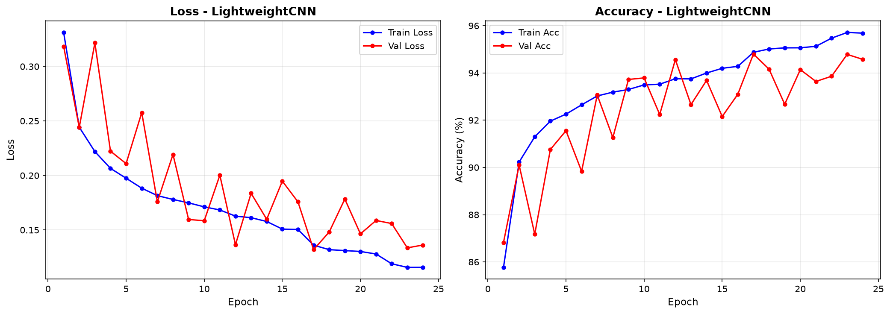

### 8.2 ResNet-50

Training: 11 epoch (early stopping) dalam 63,9 menit. Model terbaik dari **epoch 7, val acc 98,00%**. Learning rate tidak sempat diturunkan.

| Epoch | Train Loss | Train Acc | Val Loss | Val Acc | LR | Waktu (detik) |
|---|---|---|---|---|---|---|
| 1 | 0,1260 | 95,08% | 0,0760 | 97,19% | 1e-4 | 616 |
| 2 | 0,0581 | 97,89% | 0,0642 | 97,65% | 1e-4 | 731 |
| 3 | 0,0391 | 98,60% | 0,0685 | 97,71% | 1e-4 | 662 |
| 4 | 0,0298 | 98,93% | 0,0676 | 97,90% | 1e-4 | 262 |
| 5 | 0,0252 | 99,11% | 0,0628 | 97,97% | 1e-4 | 234 |
| 6 | 0,0216 | 99,27% | 0,0684 | 97,94% | 1e-4 | 204 |
| **7** | 0,0204 | 99,27% | 0,0665 | **98,00% ★** | 1e-4 | 298 |
| 8 | 0,0172 | 99,41% | 0,0697 | 97,97% | 1e-4 | 324 |
| 9 | 0,0184 | 99,34% | 0,0789 | 97,82% | 1e-4 | 238 |
| 10 | 0,0170 | 99,41% | 0,0712 | 97,88% | 1e-4 | 132 |
| 11 | 0,0158 | 99,44% | 0,0814 | 97,71% | 1e-4 | 132 |

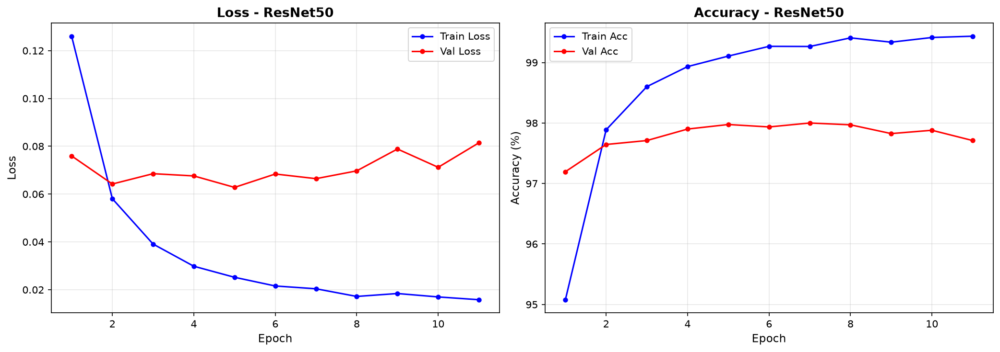

### 8.3 EfficientNetV2-B0

Training: 20 epoch (early stopping) dalam 56,8 menit. Model terbaik dari **epoch 19, val acc 98,455%**.

| Epoch | Train Loss | Train Acc | Val Loss | Val Acc | LR | Waktu (detik) |
|---|---|---|---|---|---|---|
| 1 | 0,1648 | 94,33% | 0,0678 | 97,56% | 1e-4 | 289 |
| 2 | 0,0465 | 98,30% | 0,0663 | 97,63% | 1e-4 | 456 |
| 3 | 0,0280 | 98,98% | 0,0619 | 97,97% | 1e-4 | 455 |
| 4 | 0,0223 | 99,20% | 0,0589 | 98,12% | 1e-4 | 325 |
| 5 | 0,0193 | 99,30% | 0,0587 | 98,19% | 1e-4 | 299 |
| 6 | 0,0189 | 99,34% | 0,0633 | 98,01% | 1e-4 | 107 |
| 7 | 0,0167 | 99,41% | 0,0589 | 98,13% | 1e-4 | 106 |
| 8 | 0,0182 | 99,35% | 0,0547 | 98,25% | 1e-4 | 105 |
| 9 | 0,0170 | 99,40% | 0,0530 | 98,16% | 1e-4 | 105 |
| 10 | 0,0175 | 99,38% | 0,0584 | 98,19% | 1e-4 | 106 |
| 11 | 0,0184 | 99,32% | 0,0582 | 98,05% | 1e-4 | 105 |
| 12 | 0,0171 | 99,40% | 0,0527 | 98,27% | 1e-4 | 106 |
| 13 | 0,0163 | 99,43% | 0,0536 | 98,36% | 1e-4 | 105 |
| 14 | 0,0154 | 99,46% | 0,0537 | 98,43% | 1e-4 | 104 |
| 15 | 0,0152 | 99,45% | 0,0647 | 98,10% | 1e-4 | 105 |
| 16 | 0,0151 | 99,49% | 0,0599 | 98,19% | 1e-4 | 105 |
| 17 | 0,0136 | 99,51% | 0,0646 | 98,26% | 1e-4 | 106 |
| 18 | 0,0141 | 99,47% | 0,0646 | 98,19% | 1e-4 | 106 |
| **19** | 0,0068 | 99,78% | 0,0528 | **98,45% ★** | 5e-5 | 106 |
| 20 | 0,0048 | 99,83% | 0,0547 | 98,45% | 5e-5 | 105 |

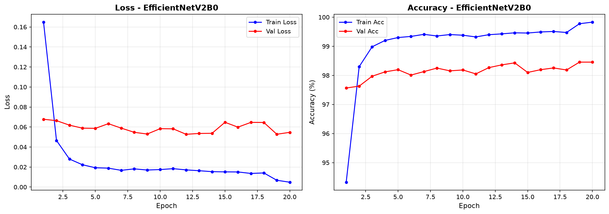

### 8.4 Ringkasan training

| | LightweightCNN | ResNet-50 | EfficientNetV2-B0 |
|---|---|---|---|
| Epoch dijalankan | 24 | 11 | 20 |
| Epoch terbaik | 17 | 7 | 19 |
| Val acc terbaik | 94,80% | 98,00% | 98,455% |
| Val acc di epoch 1 | 86,83% | 97,19% | 97,56% |
| Penurunan LR | 2× (5e-4, 2,5e-4) | 0× | 1× (5e-5) |
| Total waktu training | 61,5 menit | 63,9 menit | 56,8 menit |

Waktu per epoch sangat bervariasi (16 detik sampai 12 menit) karena pembacaan 100.000 file kecil dari disk. Epoch menjadi jauh lebih cepat setelah file masuk cache memori Windows. Karena itu, **waktu training total bukan ukuran kecepatan model yang adil**. Untuk membandingkan kecepatan, gunakan waktu inferensi di bagian 10.

---

## 9. Evaluasi pada data uji

Data uji: 20.000 citra (10.000 REAL, 10.000 FAKE), tanpa augmentasi. Untuk precision, recall, dan F1 dipakai rata-rata **macro**.

### 9.1 Metrik keseluruhan

| Metrik | LightweightCNN | ResNet-50 | EfficientNetV2-B0 |
|---|---|---|---|
| Accuracy | 94,75% | 98,155% | **98,52%** |
| Precision (macro) | 94,93% | 98,16% | **98,52%** |
| Recall (macro) | 94,75% | 98,155% | **98,52%** |
| F1-Score (macro) | 94,74% | 98,15% | **98,52%** |
| AUC-ROC | 0,9921 | 0,9978 | **0,9986** |
| Selisih val acc vs uji | −0,05% | +0,16% | +0,07% |

Akurasi uji ketiga model hampir sama dengan akurasi validasi (selisih di bawah 0,2%). Artinya pemilihan epoch berdasarkan data validasi **tidak menghasilkan estimasi yang terlalu optimistis**.

### 9.2 Metrik per kelas

| Model | Kelas | Precision | Recall | F1 |
|---|---|---|---|---|
| LightweightCNN | FAKE | 97,79% | **91,57%** | 94,58% |
| | REAL | 92,07% | 97,93% | 94,91% |
| ResNet-50 | FAKE | 98,03% | 98,29% | 98,16% |
| | REAL | 98,29% | 98,02% | 98,15% |
| EfficientNetV2-B0 | FAKE | 98,26% | **98,79%** | 98,52% |
| | REAL | 98,78% | 98,25% | 98,52% |

### 9.3 Confusion matrix

| Model | FAKE → FAKE ✅ | FAKE → REAL ❌ | REAL → FAKE ❌ | REAL → REAL ✅ | Total salah |
|---|---|---|---|---|---|
| LightweightCNN | 9.157 | **843** | 207 | 9.793 | 1.050 |
| ResNet-50 | 9.829 | 171 | 198 | 9.802 | 369 |
| EfficientNetV2-B0 | 9.879 | **121** | 175 | 9.825 | **296** |

- **FAKE → REAL:** citra AI yang lolos dianggap asli. Ini kesalahan yang paling merugikan untuk aplikasi pendeteksi.
- **REAL → FAKE:** foto asli yang salah dituduh buatan AI.

| LightweightCNN | ResNet-50 | EfficientNetV2-B0 |
|---|---|---|
| 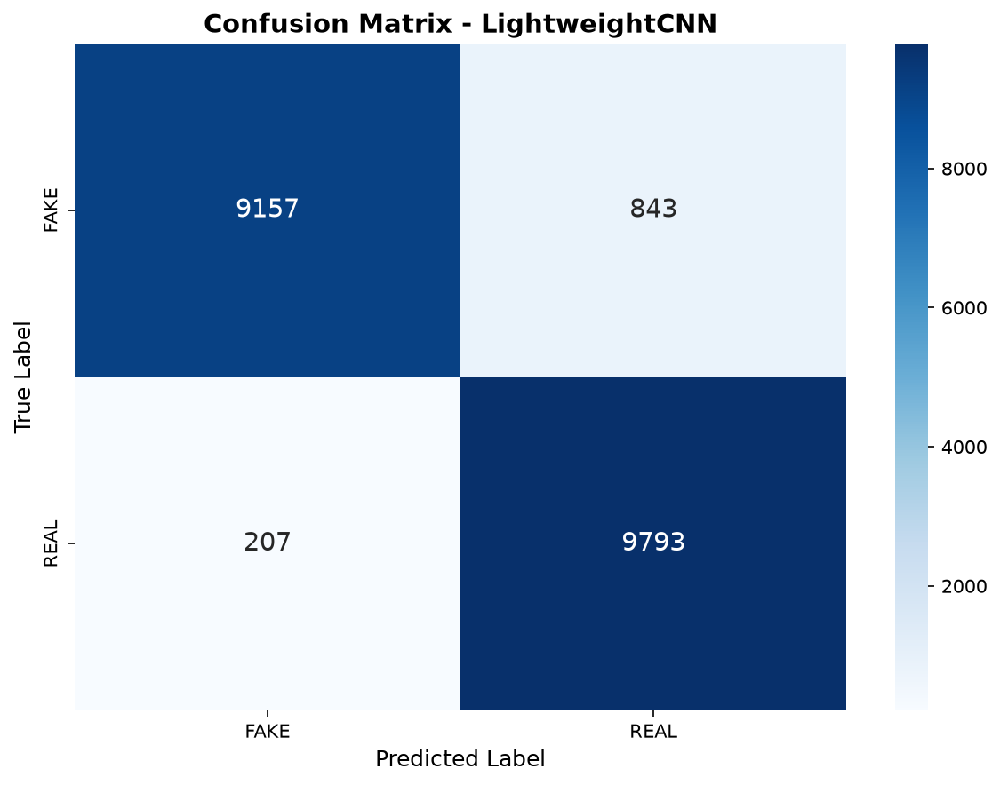 | 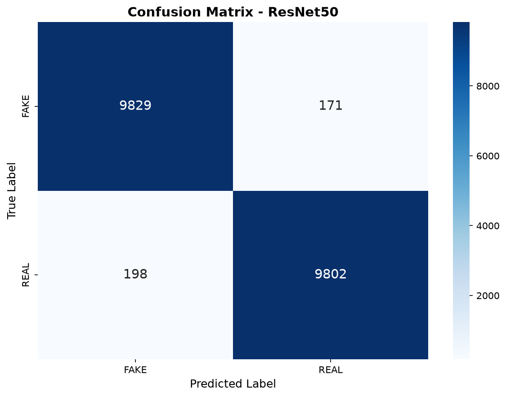 | 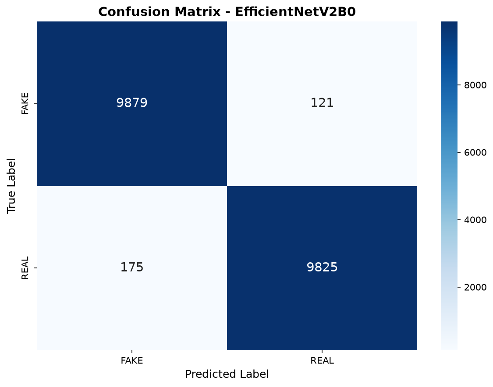 |

### 9.4 Kurva ROC

| LightweightCNN | ResNet-50 | EfficientNetV2-B0 |
|---|---|---|
| 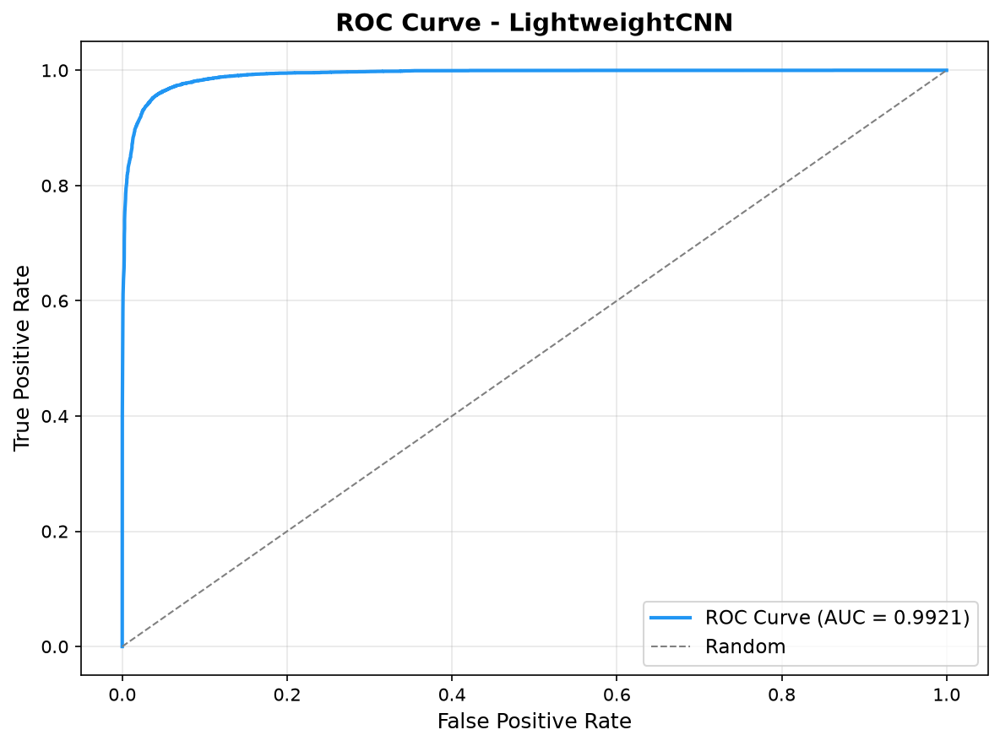 | 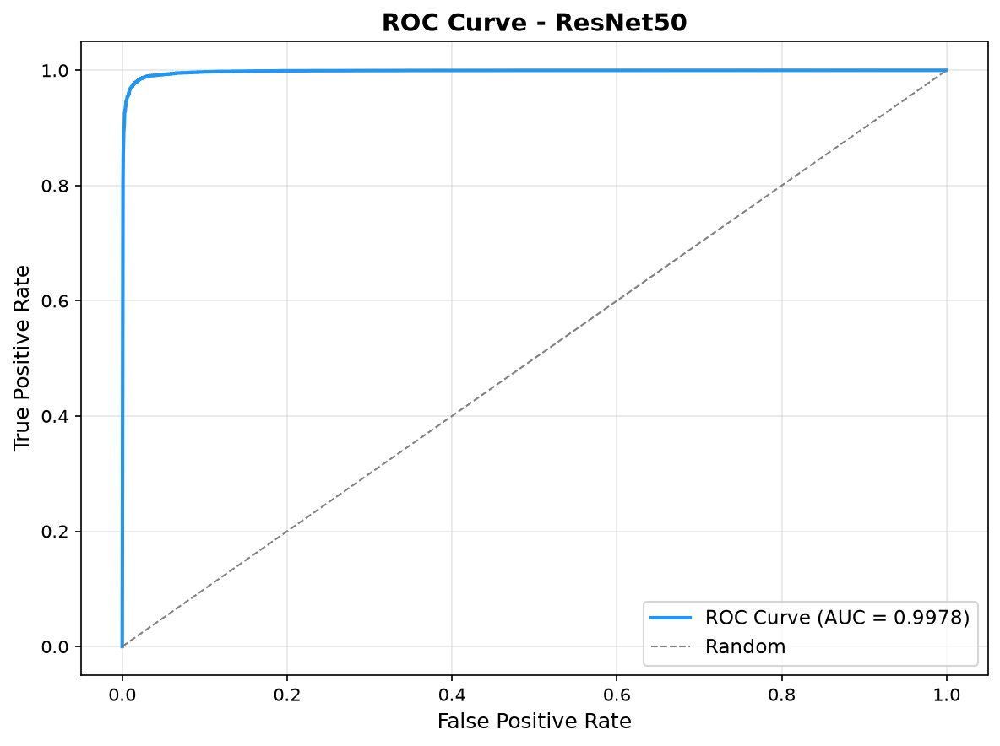 | 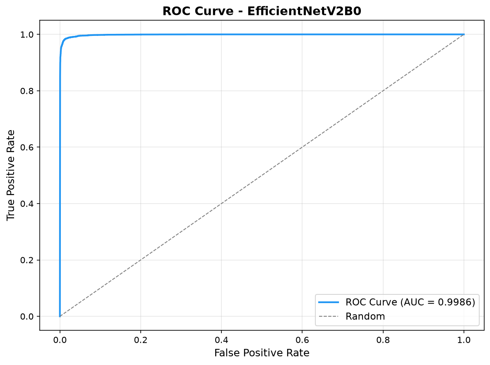 |

---

## 10. Perbandingan ketiga model

| Aspek | LightweightCNN | ResNet-50 | EfficientNetV2-B0 | Terbaik |
|---|---|---|---|---|
| Akurasi uji | 94,75% | 98,16% | **98,52%** | EfficientNetV2-B0 |
| F1-Score | 94,74% | 98,15% | **98,52%** | EfficientNetV2-B0 |
| AUC-ROC | 0,9921 | 0,9978 | **0,9986** | EfficientNetV2-B0 |
| Recall FAKE | 91,57% | 98,29% | **98,79%** | EfficientNetV2-B0 |
| Total parameter | **0,58 juta** | 23,51 juta | 5,86 juta | LightweightCNN |
| Ukuran file bobot | **2,4 MB** | 94,4 MB | 23,8 MB | LightweightCNN |
| Waktu inferensi (GPU, AMP) | **0,10 ms/citra** | 0,93 ms/citra | 0,52 ms/citra | LightweightCNN |
| Akurasi pada JPEG Q40 | 84,76% | 87,63% | **91,71%** | EfficientNetV2-B0 |

Waktu inferensi diukur dengan `compare_models.py` per batch di GPU, tanpa waktu memuat data. Batch LightweightCNN berisi 128 citra, sedangkan batch kedua model lain 32 citra, jadi angka LightweightCNN sedikit diuntungkan oleh batch yang lebih besar.

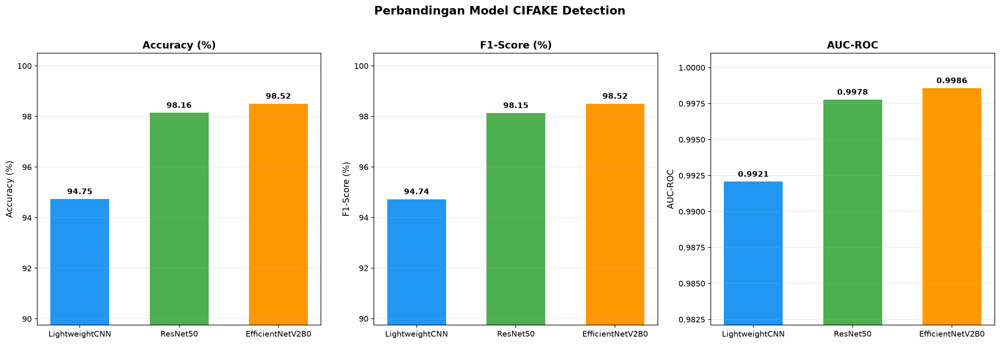

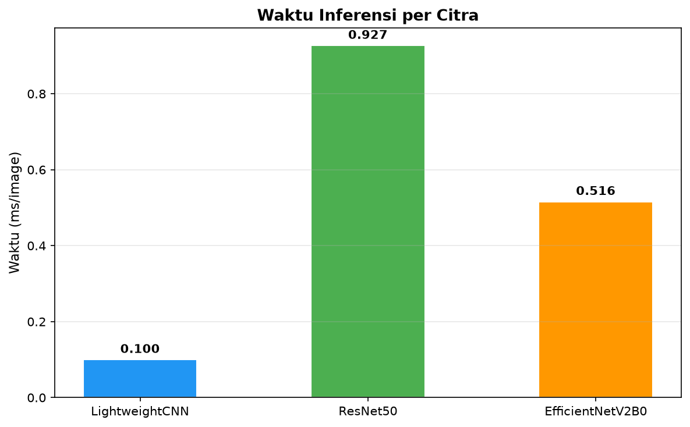

---

## 11. Uji kelayakan tambahan

### 11.1 Akurasi per kategori objek

Akurasi deteksi REAL/FAKE dihitung terpisah untuk setiap kategori (2.000 citra uji per kategori). Skrip: `evaluate_per_category.py`.

| Kategori | LightweightCNN | ResNet-50 | EfficientNetV2-B0 |
|---|---|---|---|
| Pesawat | 94,45% | 96,65% | **97,60%** |
| Mobil | 95,40% | 98,50% | **98,80%** |
| **Burung** | **90,55%** | **95,80%** | **96,20%** |
| Kucing | 95,75% | 98,75% | **98,90%** |
| Rusa | 98,05% | **99,45%** | 99,40% |
| Anjing | 95,30% | 98,80% | **99,20%** |
| Katak | 98,40% | **99,75%** | 99,50% |
| Kuda | 94,65% | 98,90% | **98,95%** |
| Kapal | 91,80% | 97,55% | **98,00%** |
| Truk | 93,15% | 97,40% | **98,65%** |

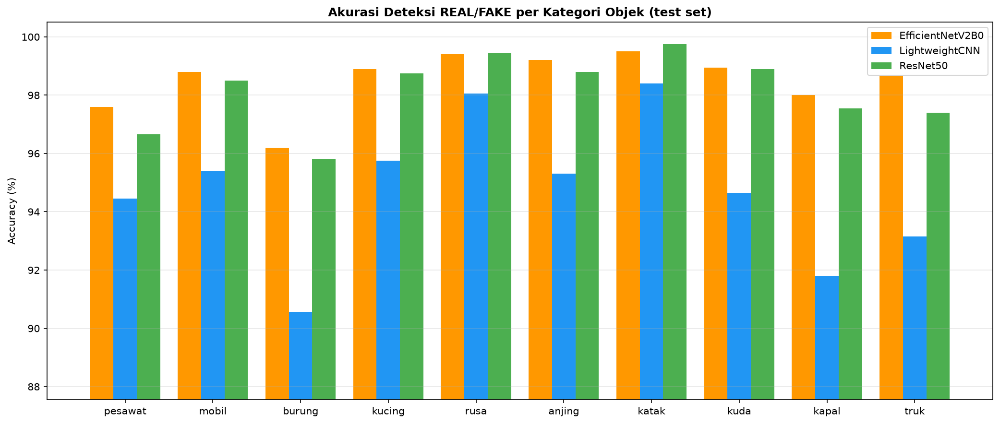

**Temuan:**
- **Burung adalah kategori tersulit bagi ketiga model.** Pada LightweightCNN, hanya 85,0% citra burung buatan AI yang terdeteksi (recall FAKE).
- **Katak dan rusa paling mudah**, dengan akurasi di atas 98% untuk semua model.
- Kategori **kendaraan** (pesawat, kapal, truk) cenderung lebih sulit dibanding mamalia.
- EfficientNetV2-B0 unggul di 8 dari 10 kategori. ResNet-50 sedikit lebih baik di rusa dan katak (selisih 0,05–0,25%).

### 11.2 Ketahanan terhadap kompresi JPEG

Citra uji dikompresi ulang secara on-the-fly dengan kualitas 80, 60, dan 40. **Q100 berarti tanpa kompresi ulang**, yaitu file asli yang sudah ber-JPEG kualitas sekitar 75. Skrip: `test_compression_robustness.py`.

**Akurasi (%):**

| Model | Q100 (asli) | Q80 | Q60 | Q40 | Penurunan Q100 → Q40 |
|---|---|---|---|---|---|
| LightweightCNN | 94,75 | 92,68 | 95,19 | 84,76 | −10,00 |
| ResNet-50 | 98,16 | 97,87 | **97,56** | 87,63 | −10,53 |
| EfficientNetV2-B0 | **98,52** | **98,24** | 97,43 | **91,71** | **−6,81** |

**AUC-ROC:**

| Model | Q100 | Q80 | Q60 | Q40 |
|---|---|---|---|---|
| LightweightCNN | 0,9921 | 0,9902 | 0,9910 | 0,9729 |
| ResNet-50 | 0,9978 | 0,9976 | 0,9969 | 0,9766 |
| EfficientNetV2-B0 | 0,9986 | 0,9981 | 0,9969 | 0,9846 |

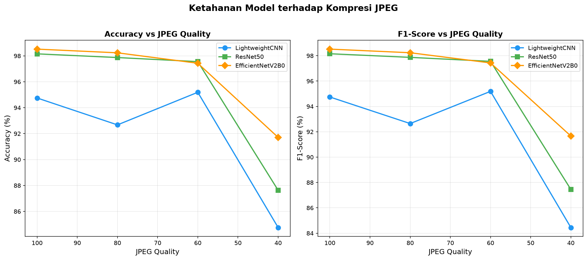

**Temuan:**
- Pada kompresi ringan sampai sedang (Q80–Q60), **kedua model transfer learning tetap di atas 97%**.
- Pada kompresi berat (Q40), semua model turun tajam, karena artefak halus yang dipakai untuk mendeteksi citra AI ikut terhapus. **EfficientNetV2-B0 paling tahan** (91,71%, turun 6,81%). ResNet-50 turun 10,53% dan LightweightCNN turun 10,00%.
- AUC tetap di atas 0,97 bahkan pada Q40. Artinya model masih bisa **mengurutkan** citra berdasarkan peluang FAKE. Penurunan akurasi lebih banyak disebabkan oleh ambang 50% yang tidak lagi tepat setelah kompresi berat.
- **LightweightCNN berperilaku tidak monoton:** akurasinya turun di Q80 (92,68%), lalu naik di Q60 (95,19%, lebih tinggi dari aslinya). Dugaan kami, model ini paling peka terhadap pola kompresi ganda, dan pada Q60 bias awalnya ke kelas REAL kebetulan bergeser ke arah seimbang. Dugaan ini **belum dibuktikan**, karena recall per kelas pada setiap tingkat kompresi belum dihitung.

### 11.3 Uji jalur aplikasi web

Model dipasang di server Flask (`web/app.py`). Alur pra-pemrosesannya: citra di-resize ke 32×32 (menyamakan dengan citra CIFAKE), lalu diberi transform evaluasi model. Pengujian lewat jalur yang sama dengan website:

| Model | 12 contoh di website | 1.000 citra uji acak (seed 1) | Rata-rata inferensi per citra |
|---|---|---|---|
| ResNet-50 | 12/12 benar | 98,5% | ~9 ms |
| EfficientNetV2-B0 | 12/12 benar | 98,7% | ~13 ms |

Waktu di tabel ini termasuk pra-pemrosesan satu citra tanpa batch, sehingga lebih besar dari waktu inferensi di bagian 10. Hasilnya konsisten dengan evaluasi resmi, jadi alur prediksi di website **sama** dengan alur evaluasi. Server juga menolak file non-gambar (HTTP 400) dan dapat memproses citra besar (1024×1024).

### 11.4 Verifikasi teknis

| Pemeriksaan | Hasil |
|---|---|
| Forward pass ketiga model | output berbentuk (batch, 2) ✅ |
| Jumlah parameter dan pembagian learning rate | sesuai rancangan ✅ |
| BatchNorm beku tidak berubah saat `train()` | ResNet-50: 43 BN beku / 10 dilatih; EfficientNet: 19 / 40 ✅ |
| Checkpoint dapat dimuat ulang | ketiga model ✅ |
| Evaluasi berulang (`evaluate.py` vs `compare_models.py`) | metrik identik ✅ |
| Kualitas JPEG REAL vs FAKE | sama (sekitar 75), tidak ada jalan pintas dari kompresi ✅ |

---

## 12. Pembahasan

1. **Transfer learning memberi keunggulan besar.** Kedua model pretrained ImageNet sudah mencapai val acc di atas 97% pada epoch pertama, sedangkan LightweightCNN butuh 17 epoch untuk mencapai 94,80%. Fitur visual umum dari ImageNet (tepi, tekstur, pola) ternyata sangat membantu mendeteksi citra AI, walaupun citranya kecil dan diperbesar ke 224×224.

2. **LightweightCNN bias ke kelas REAL.** Model ini meloloskan 843 citra AI sebagai asli (recall FAKE 91,57%), sedangkan hanya 207 foto asli yang salah dituduh. Kedua model transfer learning jauh lebih seimbang (selisih kesalahan kedua arah kurang dari 55 citra).

3. **EfficientNetV2-B0 adalah kompromi terbaik.** Dibanding ResNet-50, model ini lebih akurat (+0,36%), 20% lebih sedikit salah, paling tahan kompresi berat, serta 4× lebih kecil dan 1,8× lebih cepat. Hal ini sejalan dengan desain EfficientNet yang menyeimbangkan kedalaman, lebar, dan resolusi jaringan.

4. **Tanda overfitting dan pengendaliannya.** Pada kedua model transfer learning, train acc naik ke sekitar 99,4–99,8% sementara val loss mulai naik setelah titik terbaik (ResNet-50 setelah epoch 5, EfficientNet berfluktuasi setelah epoch 12). Early stopping dan pemilihan checkpoint terbaik mencegah model yang overfit ikut dipakai. Ini terbukti dari akurasi uji yang sama dengan akurasi validasi.

5. **Penurunan learning rate efektif di akhir training.** EfficientNet naik dari 98,19% ke 98,45% tepat setelah learning rate diturunkan ke 5e-5 (epoch 19). LightweightCNN juga mencapai titik terbaiknya tepat setelah learning rate pertama kali diturunkan (epoch 17).

6. **Model mungkin juga belajar dari gaya foto.** Citra FAKE cenderung bergaya foto profesional (bokeh, objek di tengah), sedangkan citra REAL bergaya foto amatir. Model kemungkinan memanfaatkan perbedaan gaya ini selain artefak AI. Analisis Grad-CAM (`grad_cam_viz.py`) dapat dipakai untuk memeriksa bagian citra yang diperhatikan model.

---

## 13. Keterbatasan dan ancaman validitas

| Keterbatasan | Dampak |
|---|---|
| **Satu kali training per model (satu seed)** | Variasi hasil antar seed tidak diketahui. Selisih kecil seperti ResNet-50 vs EfficientNet (0,36%) belum terbukti signifikan secara statistik. |
| **Tanpa pencarian hyperparameter** | Kedua model transfer learning memakai hyperparameter yang sama. Konfigurasi lain mungkin lebih cocok untuk salah satunya. |
| **Strategi fine-tuning tidak setara** | Parameter yang dilatih: EfficientNet 92,7%, ResNet-50 63,7%. Sebagian keunggulan EfficientNet mungkin berasal dari porsi fine-tuning yang lebih besar. |
| **Resolusi 32×32** | Detail citra sangat terbatas. Foto beresolusi tinggi harus diperkecil, dan banyak informasinya hilang. |
| **Satu generator AI** | Semua citra FAKE berasal dari Stable Diffusion v1.4. Kemampuan mendeteksi citra dari generator lain (Midjourney, DALL·E, SDXL) belum diuji. |
| **Hanya 10 kategori** | Model tidak pernah melihat manusia, makanan, pemandangan, teks, dan lainnya. Hasil untuk citra di luar 10 kategori tidak dapat diandalkan. |
| **Citra suntingan sebagian** | Model dilatih untuk citra yang sepenuhnya buatan AI, bukan foto asli yang hanya diedit dengan AI. |
| **Waktu training dipengaruhi cache disk** | Waktu training antar model tidak sepenuhnya sebanding. |
| **Uji dunia nyata belum dilakukan** | Pengujian dengan foto asli dan foto AI dari luar dataset (tahap 6) belum dijalankan. |

---

## 14. Kesimpulan dan rekomendasi

### Kesimpulan

1. Ketiga model **layak** untuk mendeteksi citra buatan AI pada domain CIFAKE. Akurasi uji semuanya di atas 94% dan AUC di atas 0,99.
2. **EfficientNetV2-B0 adalah model terbaik:**
   - akurasi 98,52%, F1 98,52%, AUC 0,9986
   - kesalahan paling sedikit (296 dari 20.000)
   - paling baik mendeteksi citra AI (recall FAKE 98,79%)
   - paling tahan kompresi berat
   - efisien: 5,86 juta parameter, 0,52 ms/citra
3. **ResNet-50** hampir setara akurasinya (98,16%), tetapi 4× lebih besar dan lebih lambat.
4. **LightweightCNN** cocok untuk perangkat dengan sumber daya terbatas, karena paling kecil (2,4 MB) dan paling cepat. Kekurangannya, akurasinya 3,8% lebih rendah dan cenderung meloloskan citra AI.

### Rekomendasi

1. **Gunakan EfficientNetV2-B0 untuk aplikasi web CekCitra.** Rekomendasi ini sudah diterapkan.
2. Jalankan **tahap 6**: uji website dengan foto asli dan foto AI dari luar dataset (hewan atau kendaraan dari 10 kategori, serta beberapa foto di luar kategori sebagai uji batasan).
3. Untuk penelitian lanjutan:
   - ulangi training dengan beberapa seed untuk mengukur variasi
   - pakai dataset dengan resolusi lebih tinggi dan generator AI yang lebih beragam
   - latih dengan augmentasi kompresi JPEG agar lebih tahan pada Q rendah
   - lakukan analisis Grad-CAM

---

## 15. Cara mereproduksi

```bash
pip install -r requirements.txt
# Unduh CIFAKE dari Kaggle, ekstrak ke data/archive/{train,test}/{REAL,FAKE}

python train.py --model LightweightCNN
python train.py --model ResNet50
python train.py --model EfficientNetV2B0

python evaluate.py --model LightweightCNN       # ulangi untuk ResNet50 dan EfficientNetV2B0
python compare_models.py                        # tabel dan grafik perbandingan
python evaluate_per_category.py                 # akurasi per kategori
python test_compression_robustness.py           # uji kompresi JPEG

python web/app.py --lan                         # website CekCitra (model default: EfficientNetV2B0)
```

### File hasil

| File | Isi |
|---|---|
| `results/<model>_history.json` | loss, akurasi, LR, dan waktu per epoch |
| `results/<model>_metrics.json` | metrik data uji dan confusion matrix |
| `results/model_comparison.csv` / `.json` | tabel perbandingan ketiga model |
| `results/per_category_accuracy.csv` / `.json` | akurasi per kategori |
| `results/compression_robustness.csv` / `.json` | hasil uji kompresi JPEG |
| `results/plots/*.png` | semua grafik di laporan ini |
| `models/<model>_best.pt` | bobot model terbaik (tidak di-commit; LightweightCNN 2,4 MB, ResNet-50 94 MB, EfficientNetV2-B0 24 MB) |
